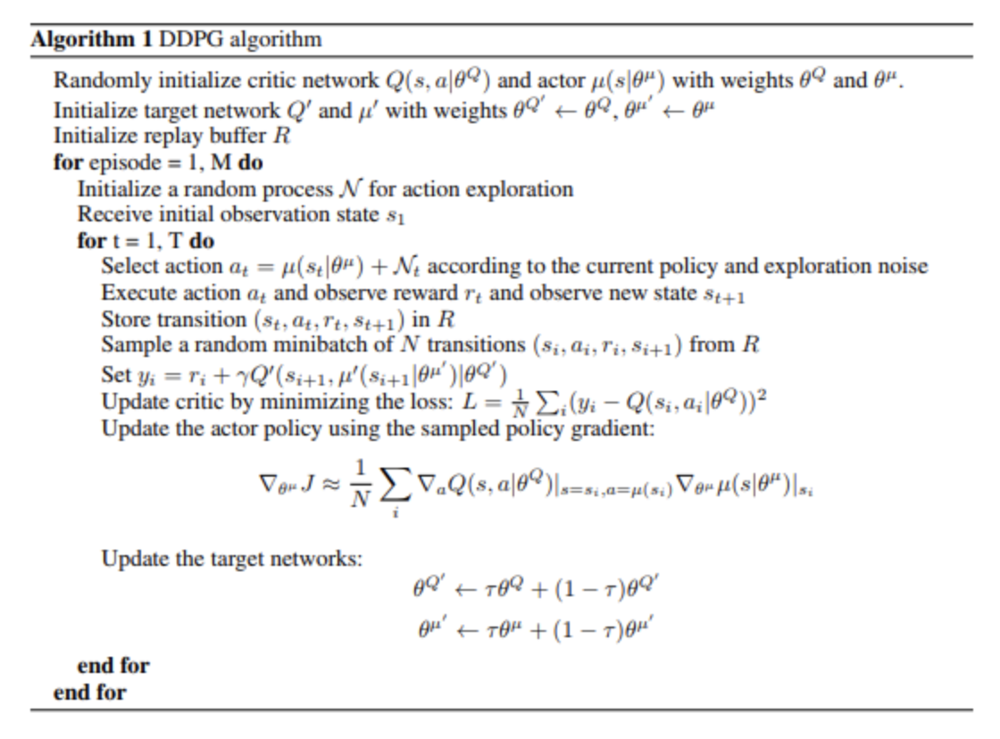
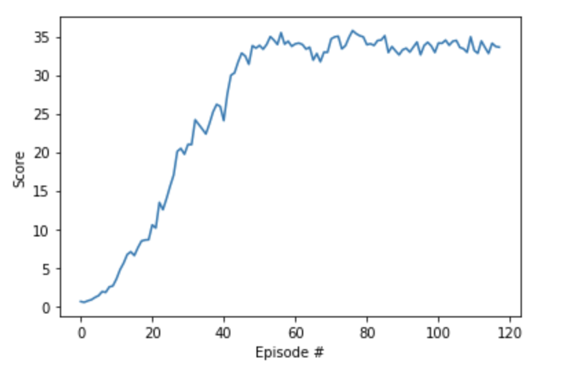

# Navigation Project

This report describes the author's approach to solve the Continuous Control project part of Udacity's [Deep Reinforcement Learning Nanodegree](https://www.udacity.com/course/deep-reinforcement-learning-nanodegree--nd893)

## Project and Environment details

For a detailed description of the project and the environment required to run the files provided, see README.md


## Agent Implementation

### Theory

This project was solved by implementing an Actor-Critic Deep Deterministic Policy Gradient to solve the 20-agent version of the environment provided. The original DDPG paper can be found [here](https://arxiv.org/pdf/1509.02971.pdf) .In this implementation, the Actor and the Critic do not share a common network. The solution was built as a modified version of the implementation of DDPG provided for the pendulum environment as part of the DRL course. The DDPG algorithm was implemented with a Replay Buffer shared by all agents (which allows for shared learning) and the noise in the process was modeled as a Ornstein-Uhlenbeck process.  


### Algorithm



Taken from “Continuous Control With Deep Reinforcement Learning” (Lillicrap et al, 2015).

### Implementation

The code consists of the following files:
- Continuous_Control.ipynb : this is a Jupyter notebook which imports the required dependencies, initializes the environment, performs the training and plots the results.
- model.py : the model is implemented as an Actor and a Critic, each with their independent network. The size of the input layer for both networks is defined by the parameter 'state_size', followed by 2 hidden fully connected layers in the case of the Actor or 3 hidden fully connected networks in the case of the Critic, followed by an output layer with size controlled by the parameter 'action_size'.
- ddpg_agent.py : this file contains three classes, the DDPG Agent itself, the Ornstein-Uhlenbeck Noise and the Replay Buffer. The DDPG Agent class includes several methods, amongst which there is an act() method which returns the action for an input state as per the current policy (with clipping between -1 and +1). The method learn() updates the value parameters of the local neural networks for Critic and Actor and then performs a soft update on the target networks. The Ornstein-Uhlenbeck Noise class models the noise in the process. The Replay Buffer class stores the experience tuples using a fixed-size buffer.


### Parameters and Results

The following are the hyperparameters used by the DDPG Agent:

```
BUFFER_SIZE = int(1e6)  # replay buffer size
BATCH_SIZE = 1024         # minibatch size
GAMMA = 0.99            # discount factor
TAU = 1e-3              # for soft update of target parameters
LR_ACTOR = 1e-3         # learning rate of the actor
LR_CRITIC = 1e-3        # learning rate of the critic
WEIGHT_DECAY = 0.0      # L2 weight decay
```

Moreover, following recommendation of the Benchmark Implementation provided in the DRL course, the following parameters were included to control how many times and after how many timesteps the networks are updated:

```
LEARNING_UPDATES = 10     # number of learning updates
UPDATE_STEPS = 20       # every n time step do update
```


For this particular case (number of states and actions in the environment), the Actor and Critic use the following architectures:

```
ACTOR
Input nodes (state_size),
Fully Connected Layer (128 nodes, Randomized Leaky-ReLu activation function),
Fully Connected Layer (64 nodes, Randomized Leaky-ReLu activation function),
Ouput nodes (action_size)
```
```
CRITIC
Input nodes (state_size),
Fully Connected Layer (256 nodes, Randomized Leaky-ReLu activation function),
Fully Connected Layer (128 nodes, Randomized Leaky-ReLu activation function),
Fully Connected Layer (64 nodes, Randomized Leaky-ReLu activation function),
Ouput nodes (action_size)
```


Note how the Randomized Leaky ReLu activation function was employed. In general, it was found that making use of Leaky ReLu functions was advantageous in stabilized training during the initial episodes.  

Given the aforementioned parameters and architecture, these are the results obtained for one of the training sessions by training locally (CPU only). The training time was of the order of 180 minutes. The 20-agent environment was solved in 118 episodes.



In comparison with the Benchmark Implementation provided by Udacity (which solved the environment in around 175 episodes), this implementation seems acceptable.


### Ideas for future work

There are multiple approaches to implement for future work. On the one hand, the approach to evaluating the environment could be modified by training the model on the pixels of the image observed by the agent instead of the state consisting of ray-based description of the surroundings (as suggested in the DRL course).

Alternatively, the architecture of the neural network used to solve the project could be improved. A Double DQN should improve the performance by avoiding the overestimation of the action values usually suffered by a single DQN. Moreover, a Dueling DQN architecture would allow for generalization of the learning process, by implementing a model-free reinforcement learning approach in which the state value function and the action value function are simultaneously estimated by two DQNs.
Other improvements to the learning process of the agent could be to implement Prioritized Experience Replay, which would allow for smoother and more efficient learning by prioritizing the most important transitions in the replay buffer.

There are multiple approaches to implement for future work. On the one hand, a more thorough investigation could be performed on the tuning of the hyperparameters (in particular the author hypothesizes the learning rates could be modified between the Actor and the Critic, to achieve better performance at latter stages as the learning slowed down after +15 episodes).
On the other hand, different methods could be used to solve the environment, such as Trust Region Policy Optimization (TRPO) and Truncated Natural Policy Gradient (TNPG). As suggested in this [paper](https://arxiv.org/pdf/1604.06778.pdf), these should be able to provide better performance. Alternatively, Proximal Policy Optimization (PPO) could be used. Top performance may not be as good, but PPO is supposed to be advantageous due to the ease of tuning compared to DDPG, as suggested by OpenAI [here](https://openai.com/blog/openai-baselines-ppo/).

Lastly, an alternative to DDPG has been recently introduced by researchers at Google Deepmind, known as Distributed Distributional Deterministic Policy Gradients [D4PG](https://arxiv.org/pdf/1804.08617.pdf).
